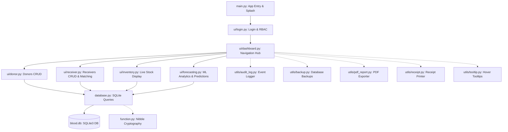

# 🩸 Modern Blood Bank Management System (BBMS)

[](https://www.python.org/)
[](https://docs.python.org/3/library/tkinter.html)
[](https://www.sqlite.org/)
[](LICENSE)

A state-of-the-art desktop application built with Python and Tkinter for managing blood bank inventory, tracking donors and receivers, matching compatible blood groups, and providing predictive analytics for blood stock levels.

---

## 🌟 Key Features

### 1. 🛡️ User Authentication & Security
- **Role-Based Access Control (RBAC)**: Supports `Admin` and `Staff` roles. Administrative actions (like record deletion, audit logs, and backups) are hidden and restricted from staff.
- **CrypTXT Nibble Encryption**: Custom encryption algorithm for securing user passwords, with automatic, backward-compatible migration.
- **Remember Me**: Saves preferences locally via encrypted configuration storage.
- **Password Strength Validation**: Enforces strong passphrases (uppercase, lowercase, digits, minimum 8 characters).

### 2. 📊 Interactive Dashboard & Analytics
- **Live Inventory Cards**: Real-time visualization of total donors, receivers, and total blood units.
- **Alert Panels**:
  - **Low Inventory Warnings**: Highlights blood groups with $\le 5$ units in red.
  - **Expiring Blood Units**: Tracks the standard 42-day shelf life and highlights units expiring within 7 days.
- **Dual-Theme Engine**: Seamless toggle between a premium **Dark Mode** and a clean **Light Mode**.

### 3. 👥 Patient & Donor Management
- **Donor Registry**: Complete CRUD actions, age validation, disease screening check, and thermal slip printing.
- **Receiver Registry**: Integrated ABO/Rh compatibility checker that ensures safe allocation of blood units.
- **Data Export**: One-click CSV exports for donor, receiver, and inventory databases.

### 4. 🖨️ Professional Reporting & Utilities
- **PDF Report Exporter**: Generates beautifully formatted tabular PDF reports for donors, receivers, and inventory using `fpdf2`.
- **System Backups**: One-click timestamped database backup and restore, complete with pre-restore safety copies (`blood.db.pre_restore`).
- **Green-on-Black Audit Viewer**: Command-line style viewer inside the app to inspect the system's `audit.log` file.

---

## 🏗️ System Architecture

The project is structured modularly to separate UI components from business logic and database queries:



---

## 📂 Project Structure

```bash
Modern_Blood_Bank/
├── main.py                  # App entry point, splash screen, and AppManager
├── database.py              # SQLite queries, password hashing, and core business logic
├── constants.py             # System configurations, roles, and blood group mappings
├── function.py              # Custom cryptography routines (Nibble Encryption)
├── blood.db                 # SQLite database file (automatically created)
├── config.json              # App configuration preferences (Remember Me)
├── audit.log                # System activity audit logs
├── techstack.txt            # Project tech stack description
│
├── ui/                      # Tkinter GUI Modules
│   ├── __init__.py
│   ├── styles.py            # Theme system colors and ttk styles
│   ├── login.py             # Login, registration, and password recovery
│   ├── dashboard.py         # Main dashboard, alerts, and navigation
│   ├── donor.py             # Donor registration, profiling, and search
│   ├── receiver.py          # Receiver profiling, search, and compatibility matching
│   ├── inventory.py         # Live stock display
│   └── forecasting.py       # ML inventory predictions and analytics
│
└── utils/                   # System Utilities
    ├── __init__.py
    ├── audit_log.py         # Appends actions to audit.log
    ├── backup.py            # Database backup and restore operations
    ├── blood_match.py       # ABO/Rh compatibility rules engine
    ├── export.py            # CSV generation helper
    ├── pdf_report.py        # PDF exports (fpfd2)
    ├── receipt.py           # Receipt slip printing
    └── tooltip.py           # Custom tooltip widgets
```

---

## ⚡ Keyboard Shortcuts

Accelerate workflow speed with built-in system hotkeys:

| Shortcut | Description |
| :--- | :--- |
| `Ctrl + 1` | Open Donor Management |
| `Ctrl + 2` | Open Receiver Management |
| `Ctrl + 3` | Open Blood Inventory |
| `Ctrl + S` | Save / Register current form record |
| `Ctrl + D` | Delete selected record (Admin only) |
| `Esc` | Clear all input fields in the active form |

---

## 🚀 Getting Started

### Prerequisites
- Python 3.8 or higher installed.

### Installation

1. **Clone the Repository:**
   ```bash
   git clone https://github.com/amaan-exe/BBMS.git
   cd BBMS
   ```

2. **Set up a Virtual Environment (Recommended):**
   ```bash
   python -m venv .venv
   # On Windows:
   .venv\Scripts\activate
   # On macOS/Linux:
   source .venv/bin/activate
   ```

3. **Install Dependencies:**
   ```bash
   pip install -r requirements.txt
   # Or install packages manually:
   pip install pillow tkcalendar fpdf2
   ```

4. **Run the Application:**
   ```bash
   python main.py
   ```

---

## 🔒 Security Policy
This project uses custom **CrypTXT Nibble Encryption** for obfuscating credentials. 
- **Encryption**: Obfuscates byte segments by shifting nibbles during string operations.
- **Migration**: Old password hashes from legacy system versions are auto-detected during login and safely updated on the fly to secure storage patterns.

---

## 📝 License
Distributed under the MIT License. See `LICENSE` for more information.
